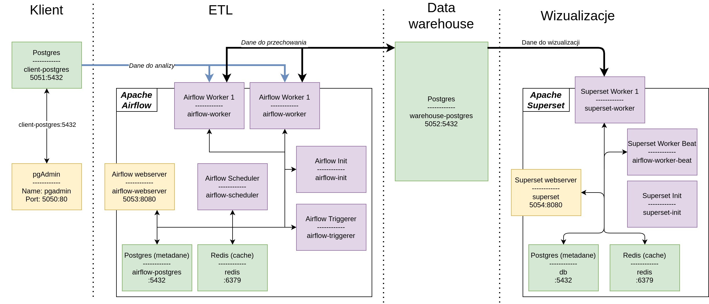

# Airflow + Postgres + Superset

## Architecture



## Run

    git clone git@github.com:finloop/airflow-postgres-superset-on-docker.git
    cd airflow-postgres-superset-on-docker

To run the services you will need the id of the current user, which should be placed
in a file `.env` and assign to a variable `AIRFLOW_UID`. On linux, issue following command to get users id:

```sh
id -u
```

Sample file `.env` looks like this:

```text
AIRFLOW_UID=1000
```

And finally, we launch all the services:

```sh
docker-compose up
```

After running them, you should put the sample data in the database. We do this:

```sh
python init-postgres.py
```

### Web services

*   [pgAdmin](http://localhost:5050)
*   [Airflow](http://localhost:5053)
*   [Superset](http://localhost:5054)

### Other services available to the host

*   client-postgres: [localhost:5051](\[localhost:5051])
*   warehouse-postgres: [localhost:5052](\[localhost:5052])

### Maps in Apache Superset

In order for maps in Apache Superset to work, you will need a key to the API. It can be
get it for free here: [Mapbox](www.mapbox.com/). It should be placed
in a file `superset/docker/.env-non-dev` as `MAPBOX_API_KEY`. In the following
way:

```txt
MAPBOX_API_KEY='YOUR_API_KEY_FROM_MAPBOX1234567890'
```

## Customer base

To use the client database (do not enable other services) use the command:

    docker-compose up client-postgres pgadmin

Database address (for pgAdmina): `client-postgres:5432`

Database configuration and pgAdmin:

```text
POSTGRES_USER: postgres
POSTGRES_PASSWORD: postgres
POSTGRES_DB: postgres
PGADMIN_DEFAULT_EMAIL: admin@admin.com
PGADMIN_DEFAULT_PASSWORD: admin
```
