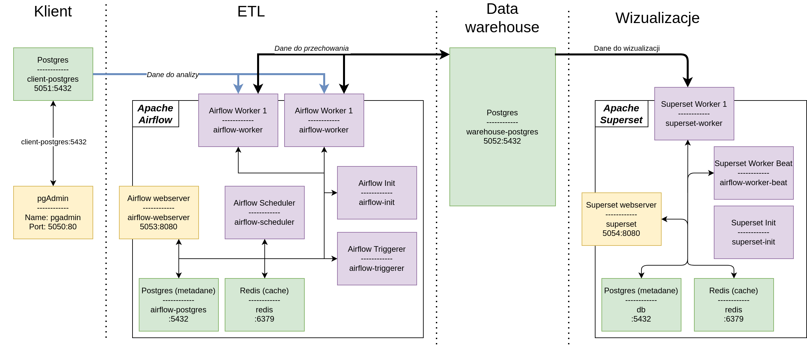

# Airflow + Postgres + Superset

## Architektura


## Baza klienta
Aby korzystać z bazy klienta (nie włączająć pozostałych serwisów) należy użyć polecenia:
```
docker-compose up client-postgres pgadmin
```
Konfiguracja bazy i pgAdmin:
``` text
POSTGRES_USER: postgres
POSTGRES_PASSWORD: postgres
POSTGRES_DB: postgres
PGADMIN_DEFAULT_EMAIL: admin@admin.com
PGADMIN_DEFAULT_PASSWORD: admin
```